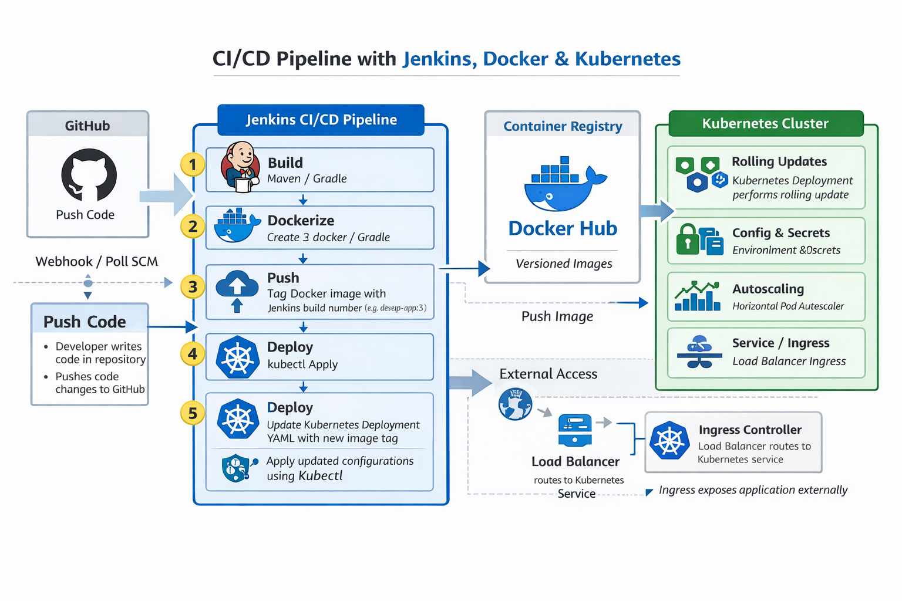

# 🚀 End-to-End CI/CD Pipeline using Jenkins, Docker & Kubernetes

## 📌 Overview
This project demonstrates the design, automation, deployment, and validation of a production-style CI/CD pipeline using **Jenkins**, **Docker**, and **Kubernetes**. 

The pipeline automates the entire workflow from source code commit to containerized application deployment inside a Kubernetes cluster, following real-world DevOps engineering best practices.

**The project emphasizes:**
* **Automation:** Fully hands-off deployment.
* **Zero-downtime deployments:** Rolling updates via K8s.
* **Infrastructure reliability:** Self-healing and scalable.
* **Secure credential management:** No hardcoded secrets.
* **Self-healing systems:** Automatic recovery of failed components.
* **Scalable architecture:** Dynamic resource adjustment.

---

## 🏗️ Architecture Diagram

**Workflow:**
Developer → GitHub Repository → Jenkins Pipeline → Docker Image Build → Docker Hub Registry → Kubernetes Deployment → Running Application Pods

---

## 🔄 Request & Deployment Flow
* **Trigger:** Developer pushes code to GitHub, triggering the Jenkins pipeline.
* **Build:** Jenkins builds the Docker image using a multi-stage Dockerfile.
* **Registry:** Image is tagged with the build number and pushed to Docker Hub.
* **Orchestration:** Jenkins updates the Kubernetes Deployment with the new image tag.
* **Deployment:** Kubernetes performs a rolling update; new pods become Ready while old pods are terminated without downtime.
* **Access:** The application becomes accessible via Service/Ingress.

---

## 🧱 Architecture Components

### 1️⃣ CI/CD Layer (Jenkins)
* **Declarative Pipeline:** Clean, versioned pipeline-as-code.
* **Automated Build:** Hands-free Docker image creation.
* **Secure Auth:** Integrated Docker Hub authentication.
* **Deployment:** Automated `kubectl` application.

### 2️⃣ Containerization Layer (Docker)
* **Multi-stage Builds:** Optimized, lightweight production-ready images.
* **Tagging Strategy:** Versioned images mapped to Jenkins build numbers.
* **Registry:** Docker Hub utilized as the global image registry.

### 3️⃣ Orchestration Layer (Kubernetes)
* **High Availability:** ReplicaSets ensure constant uptime.
* **Health Checks:** Liveness and Readiness probes verify application status.
* **Configuration:** ConfigMaps and Secrets for environment and sensitive data.
* **Scaling:** Horizontal Pod Autoscaler (HPA) manages load based on CPU.

---

## 🔐 Security Design
* **Credential Manager:** Docker credentials stored securely in Jenkins.
* **Secret Management:** Kubernetes Secrets used for runtime sensitive values.
* **Least Privilege:** Cluster access managed via scoped `kubeconfig` credentials.

---

## 📈 Scalability & High Availability
* **Rolling Updates:** Zero-downtime deployment logic.
* **Self-Healing:** Deployment controller automatically recreates crashed pods.
* **HPA:** Automatic scaling based on real-time CPU utilization.

---

## 🧪 Testing & Validation Performed
* **Build Validation:** Verified successful image creation and registry push.
* **Update Behavior:** Confirmed Kubernetes rolling update success.
* **Resilience Testing:** Simulated pod crashes to verify self-healing.
* **Probe Verification:** Validated readiness and liveness probe functionality.

---

## 📊 Operational Validation

**Monitor rollout status:**
`kubectl rollout status deployment/devops-app`

**Verify HPA scaling:**
`kubectl get hpa`

**Test local access via port-forward:**
`kubectl port-forward deployment/devops-app 5000:5000`

---

## 🧠 Challenges & Learnings
* **Debugging:** Resolved image misconfigurations and base image issues.
* **Probes:** Fixed readiness probe failures to ensure traffic only hits healthy pods.
* **Mechanics:** Gained deep understanding of Kubernetes rolling updates vs. manual pod deletion.

---

## 🛠️ Technologies Used
* **GitHub:** Source Control
* **Jenkins:** CI/CD Automation
* **Docker / Docker Hub:** Containerization
* **Kubernetes (Minikube):** Orchestration
* **Linux / Kubectl:** Infrastructure Management

---

## 💰 Resource Optimization
* **Minikube:** Used for cost-efficient local development.
* **Versioned Images:** Avoids unnecessary rebuilds and provides easy rollbacks.
* **Replica Scaling:** Prevents over-provisioning of resources.

---

## 🧹 Cleanup
**Remove all resources:**
`kubectl delete deployment --all && kubectl delete service --all && kubectl delete hpa --all`

**Full Cluster Recreation:**
`kubectl apply -f k8s/`

---

## 🏁 Conclusion
This project showcases a real-world DevOps CI/CD pipeline, demonstrating end-to-end automation, container lifecycle management, and production-style troubleshooting.
